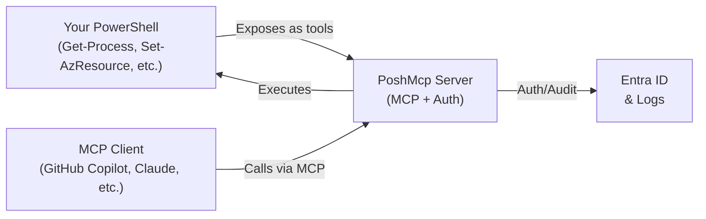

# PoshMcp Documentation

**Transform PowerShell into AI-consumable tools with zero code changes.**

PoshMcp is an open-source Model Context Protocol (MCP) server that securely exposes PowerShell commands to AI assistants and other MCP clients. Whether you're automating cloud infrastructure, system administration, or DevOps workflows, PoshMcp bridges the gap between AI capabilities and your existing PowerShell expertise.

## Quick Navigation

- **[Getting Started](articles/getting-started.md)** — Install and run PoshMcp in minutes
- **[Configuration Guide](articles/configuration.md)** — Configure PowerShell tools and modules
- **[Entra ID Authentication](articles/authentication.md)** — Secure with OAuth 2.1 and Managed Identity
- **[Docker Deployment](articles/docker.md)** — Build and run containerized instances
- **[API Reference](https://usepowershell.github.io/PoshMcp/api/PoshMcp.html)** — C# API documentation for developers

## Why PoshMcp?

### 🔧 Zero-Code Integration
Expose any PowerShell function or module command without writing C# code. Use familiar CLI commands to configure which tools AI assistants can access.

### 🔐 Enterprise Security
- OAuth 2.1 authentication with Entra ID
- Automatic Managed Identity support on Azure
- Token validation and per-user audit trails
- RBAC integration via PowerShell scopes

### 🚀 Multiple Deployment Models
- Local development with VS Code and GitHub Copilot
- HTTP server for custom integrations
- Docker containers for cloud and on-premises
- Azure Container Apps for managed, scalable deployments

### 📡 Model Context Protocol (MCP)
PoshMcp implements the MCP specification, enabling seamless integration with:
- GitHub Copilot
- Claude (Anthropic)
- Any MCP-compatible AI client

## What Can You Do?

- **Expose PowerShell modules** to AI assistants for Infrastructure-as-Code, system admin, and DevOps
- **Automate cloud operations** — let AI call your Az PowerShell commands securely
- **Build intelligent workflows** — combine PowerShell logic with AI reasoning
- **Maintain compliance** — audit-log every tool invocation with user identity
- **Scale across teams** — shared HTTP or Container Apps deployments with multi-tenant support

## Installation (30 seconds)

```bash
dotnet tool install -g poshmcp

poshmcp create-config

poshmcp serve --transport stdio
```

Then point your MCP client at it and start using PowerShell tools.

## How It Works



## Learn More

| Topic | Link |
|-------|------|
| **Installation & Configuration** | [Getting Started](articles/getting-started.md) |
| **Security & Authentication** | [Entra ID Guide](articles/authentication.md) |
| **Docker & Containerization** | [Docker Deployment](articles/docker.md) |
| **Advanced Topics** | [Advanced Guide](articles/advanced.md) |
| **API Reference** | [C# API Docs](https://usepowershell.github.io/PoshMcp/api/PoshMcp.html) |
| **Examples** | [Examples](articles/examples.md) |
| **Troubleshooting** | [FAQ & Troubleshooting](articles/troubleshooting.md) |

## Community & Support

- **GitHub Issues** — [Report bugs or request features](https://github.com/usepowershell/poshmcp/issues)
- **GitHub Discussions** — [Ask questions and share ideas](https://github.com/usepowershell/poshmcp/discussions)
- **Contributing** — [Contribute to PoshMcp](https://github.com/usepowershell/poshmcp/blob/main/CONTRIBUTING.md)

---

**Ready to get started?** → [Go to Getting Started](articles/getting-started.md)
